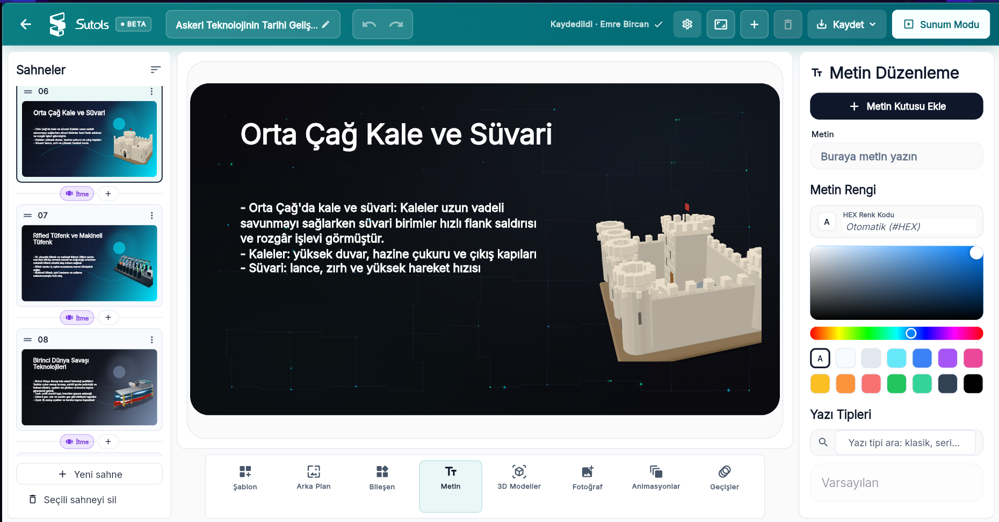
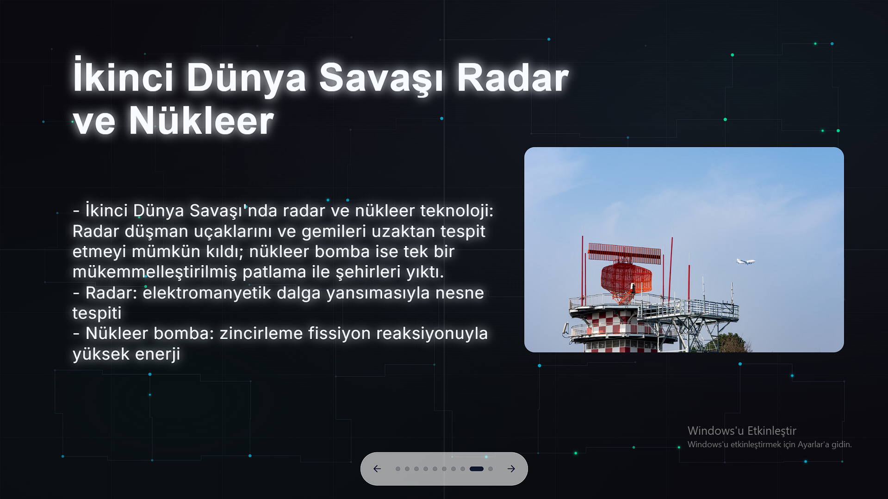
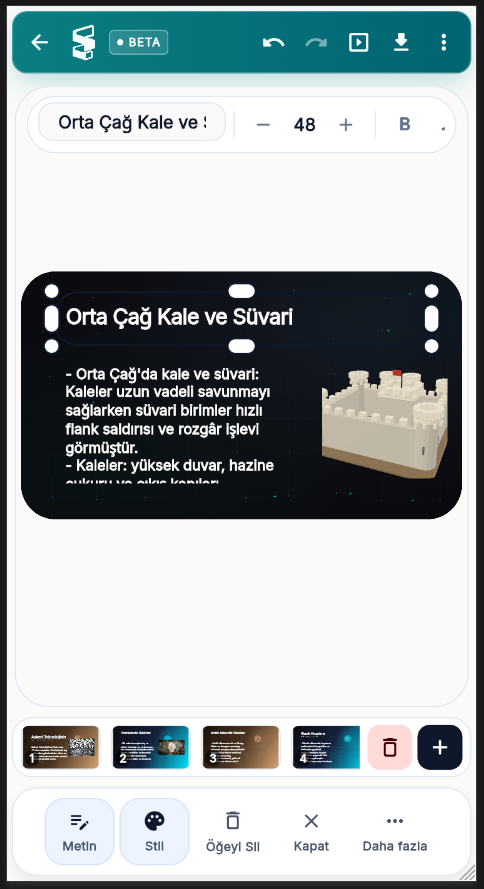

<p align="center">
  
</p>

<p align="center">Başlık ve metinlerden düzenlenebilir HTML sunumları oluşturan Flutter Web uygulaması.</p>

<p align="center">
  <a href="https://flutter.dev/"></a>
  <a href="https://dart.dev/"></a>
  <a href="https://firebase.google.com/"></a>
  <a href="#kurulum"></a>
</p>

Sutol, içerikleri anahtar kelime ve benzerlik eşleştirmesiyle analiz eder; konuya uygun arka planları, yerleşimleri ve görsel bileşenleri seçerek sonucu doğrudan düzenlenebilir bir sunum projesine dönüştürür.

> [!NOTE]
> Otomatik oluşturma akışı harici bir yapay zekâ servisine bağlanmadan, yerel ve deterministik kurallarla çalışır.

## Canlı Demo

Bu depo için henüz kamuya açık bir demo bağlantısı bulunmuyor. Uygulamayı yerelde başlatmak için [Kurulum](#kurulum) bölümünü izleyin.

## Ürün Görünümü

<p align="center">
  
</p>

<p align="center"><sub>Sunum düzenleyicisi — sahneler, araçlar ve ayrıntılı özellikler tek çalışma alanında.</sub></p>

<table>
  <tr>
    <td width="76%" align="center" valign="top">
      
      <br />
      <sub>Odaklanmış sunum modu</sub>
    </td>
    <td width="24%" align="center" valign="top">
      
      <br />
      <sub>Mobil düzenleme deneyimi</sub>
    </td>
  </tr>
</table>

## Neler Sunar

- **İçerikten taslağa:** Başlık ve metinden uygun sayfa düzeni, arka plan ve bileşenler oluşturur.
- **Tam kontrol:** Metinler, görseller, efektler, reveal adımları, hotspot’lar ve sunucu notları editörde yönetilir.
- **Esnek çıktı:** Çalışmalar Sutol JSON proje dosyası olarak saklanır; tek HTML dosyası veya tarayıcı üzerinden PDF olarak dışa aktarılır.
- **Her ekrana uyum:** Düzenleme ve sunum deneyimi hem masaüstünde hem mobilde kullanılabilir.

## Önizleme Akışı

1. Bir sunum oluşturun ve slaytlarınız için başlık ile metin ekleyin.
2. İçeriği oluşturun; Sutol uygun bileşenleri ve yerleşimi hazırlasın.
3. Editörde ayrıntıları düzenleyin, sunum modunda gözden geçirin ve dışa aktarın.

## İçindekiler

- [Neler Sunar](#neler-sunar)
- [Önizleme Akışı](#önizleme-akışı)
- [Öne Çıkanlar](#öne-çıkanlar)
- [Nasıl Çalışır](#nasıl-çalışır)
- [Teknoloji](#teknoloji)
- [Proje Yapısı](#proje-yapısı)
- [Kurulum](#kurulum)
- [Test ve Doğrulama](#test-ve-doğrulama)
- [Kullanım Notları](#kullanım-notları)
- [Bilinen Sınırlamalar](#bilinen-sınırlamalar)
- [Katkıda Bulunma](#katkıda-bulunma)
- [İngilizce Sürüm](#ingilizce-sürüm)
- [Lisans](#lisans)

## Öne Çıkanlar

- **Otomatik sunum üretimi:** Başlık ve metin girdilerinden sayfa düzeni, arka plan ve bileşen seçimi yapılır.
- **Akıllı eşleştirme:** Türkçe ve İngilizce anahtar kelimeler ile benzerlik tabanlı seçim mekanizması kullanılır.
- **Düzenlenebilir HTML çıktı:** Üretilen sunumlar HTML tabanlıdır ve editörde ayrıntılı biçimde özelleştirilebilir.
- **Geniş bileşen kataloğu:** Konuya göre farklı arka planlar, görseller ve sahne bileşenleri kullanılabilir.
- **Sunum editörü:** Sayfa düzeni, efektler, reveal adımları, hotspot’lar ve sunucu notları tek bir arayüzden yönetilir.
- **Sunum modu:** Tam ekran gösterim, klavye gezinmesi ve yakınlaştırma desteklenir.
- **Proje kaydı ve geri yükleme:** Çalışmalar Sutol JSON proje dosyası olarak dışa aktarılabilir ve yeniden açılabilir.
- **Dışa aktarma:** Sunumlar tek HTML dosyası olarak indirilebilir veya tarayıcı üzerinden PDF olarak kaydedilebilir.

## Nasıl Çalışır

1. Ana ekrandan **Sunum Oluştur** seçilir.
2. Her slayt için başlık ve metin girilir; gerekirse yeni sayfalar eklenir.
3. **Sunumu Oluştur** komutu ile boş sayfalar atlanır ve içerik analiz edilir.
4. Uygulama her sayfa için uygun arka planı, yerleşimi ve görsel bileşenleri belirler.
5. Oluşturulan sunum editörde düzenlenir, önizlenir ve istenen formatta dışa aktarılır.

Basitleştirilmiş veri akışı:

```text
Başlık + Metin
      │
      ▼
PresentationAutoBuilder
  ├─ anahtar kelime ve benzerlik analizi
  ├─ arka plan seçimi
  └─ bileşen ve yerleşim seçimi
      │
      ▼
SlideModel
      │
      ▼
HtmlPresentationEditorPage
  ├─ PresentationPreviewPage       → sunum modu
  ├─ PresentationExportBuilder     → HTML / PDF dışa aktarma
  └─ PresentationProjectCodec      → Sutol JSON proje dosyası
```

## Teknoloji

- **Flutter Web**
- **Dart**
- **Firebase**
  - Authentication
  - Firestore
  - Firebase AI
- **Yerel servisler**
  - proje kaydı ve yükleme
  - içerik eşleştirme
  - HTML dışa aktarma
  - tam ekran ve paylaşım akışları

## Proje Yapısı

```text
lib/
├── main.dart
├── models/
│   ├── presentation_component_catalog.dart
│   ├── presentation_template_catalog.dart
│   └── slide_model.dart
├── services/
│   ├── presentation_auto_builder.dart
│   ├── presentation_export_builder.dart
│   ├── presentation_keyword_catalog.dart
│   ├── presentation_project_codec.dart
│   └── presentation_service.dart
├── state/
│   └── presentation_controller.dart
└── ui/
    ├── home_page.dart
    ├── ai_draft_page.dart
    ├── html_presentation_editor_page.dart
    ├── presentation_editor_page.dart
    ├── presentation_preview_page.dart
    └── widgets/
        └── html_stage/
test/
├── presentation_auto_builder_test.dart
├── presentation_controller_test.dart
└── presentation_project_codec_test.dart
tool/
└── içerik üretimi, kategorileme ve doğrulama araçları
web/
└── Flutter Web başlangıç dosyaları
```

## Kurulum

### Gereksinimler

- Flutter SDK `>=3.5.0 <4.0.0`
- Chrome veya güncel bir Chromium tabanlı tarayıcı
- İsteğe bağlı: üretim build’ini yerelde sunmak için Python 3

Bağımlılıkları yükleyin:

```bash
flutter pub get
```

Uygulamayı geliştirme modunda çalıştırın:

```bash
flutter run -d chrome
```

Üretim web build’i oluşturun:

```bash
flutter build web
```

Build çıktısını yerelde sunmak isterseniz:

```bash
python3 -m http.server 8080 --directory build/web
```

Ardından `http://localhost:8080` adresini açın.

## Test ve Doğrulama

Kod biçimini kontrol edin:

```bash
dart format --output=none --set-exit-if-changed lib test
```

Statik analizi çalıştırın:

```bash
flutter analyze
```

Birim testlerini çalıştırın:

```bash
flutter test
```

Web build’ini doğrulayın:

```bash
flutter build web
```

Önerilen manuel kontroller:

- Türkçe, İngilizce ve yazım hatası içeren metinlerde uygun arka plan ve bileşen eşleşmesini doğrulayın.
- Boş girişte editöre geçiş yapılmadığını ve uyarı gösterildiğini kontrol edin.
- Metin ve bileşenlerin taşınabildiğini, yeniden boyutlandırılabildiğini ve silinebildiğini test edin.
- Geri alma/yineleme, reveal, hotspot, sunucu notu ve efekt ayarlarını deneyin.
- Sutol JSON dosyasını kaydedip yeniden yükleyin.
- HTML dışa aktarmayı yeni sekmede açın; PDF seçeneğinin yazdırma akışını başlattığını doğrulayın.

## Kullanım Notları

Sunum modundaki temel klavye kısayolları:

| Tuş | İşlev |
|---|---|
| `→`, `Page Down`, `Space` | Sonraki reveal adımı veya slayt |
| `←`, `Page Up`, `Backspace` | Önceki reveal adımı veya slayt |
| `F` | Tam ekranı aç/kapat |
| `Z`, `+` | Yakınlaştırmayı aç/kapat |
| `P`, `N` | Sunucu notları panelini aç/kapat |
| `Esc` | Sunum modundan çık |

Editörde geri alma için `Ctrl/Cmd + Z`; yineleme için `Ctrl + Y` veya `Cmd + Shift + Z` kullanılabilir.

## Bilinen Sınırlamalar

- İçerik analizi anahtar kelime ve benzerlik tabanlıdır; bağlamsal bir model kullanmaz.
- Fuzzy eşleştirme, kısa kelimelerde yanlış pozitifleri azaltmak için daha katı davranabilir.
- PDF dışa aktarma, tarayıcının yazdırma akışını kullanır.
- Proje kaydetme, yükleme ve dışa aktarma akışları öncelikle web hedefi için tasarlanmıştır.
- MP4 veya doğrudan video dışa aktarma şu anda desteklenmez.

## Katkıda Bulunma

Değişiklik göndermeden önce:

1. `dart format --output=none --set-exit-if-changed lib test` komutunu çalıştırın.
2. `flutter analyze` ve `flutter test` çıktılarının temiz olduğundan emin olun.
3. Yeni davranışlar için gerekli testleri ekleyin veya güncelleyin.
4. Commit mesajını değişikliğin amacını açıkça anlatacak şekilde yazın.

## İngilizce Sürüm

İngilizce README sürümü için [README.en.md](README.en.md) dosyasına bakın.

## Lisans

Bu depo için henüz bir kök lisans dosyası belirtilmemiştir. Kaynak kodu kullanmadan veya dağıtmadan önce proje sahibinden izin alın. `sutol-model-proxy/` altındaki yardımcı projenin lisans ve kullanım koşulları ayrıca geçerlidir.
